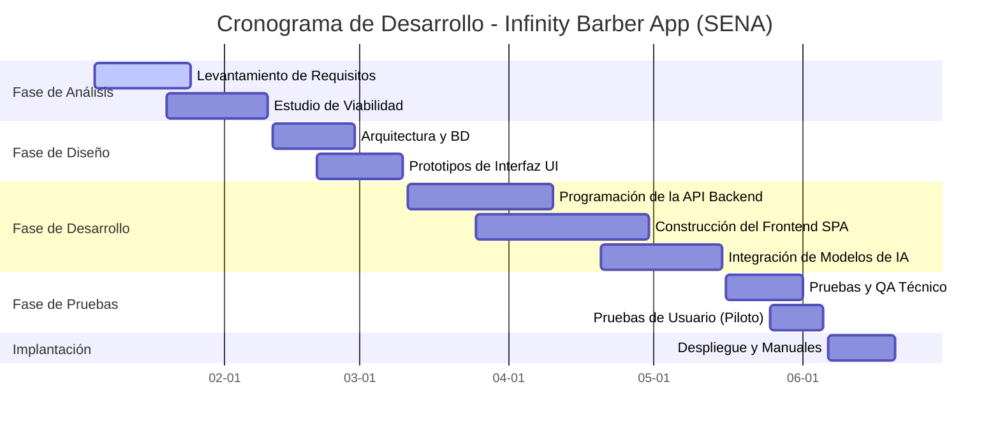
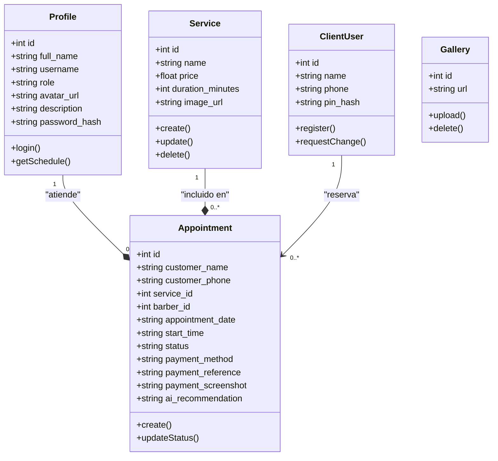
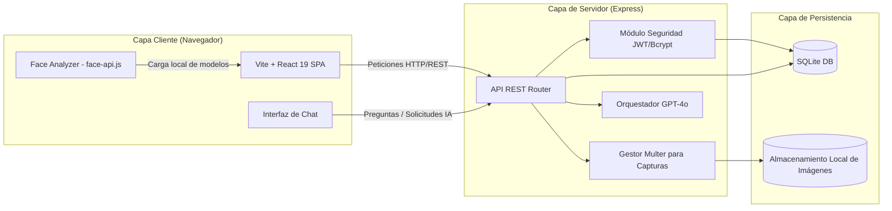
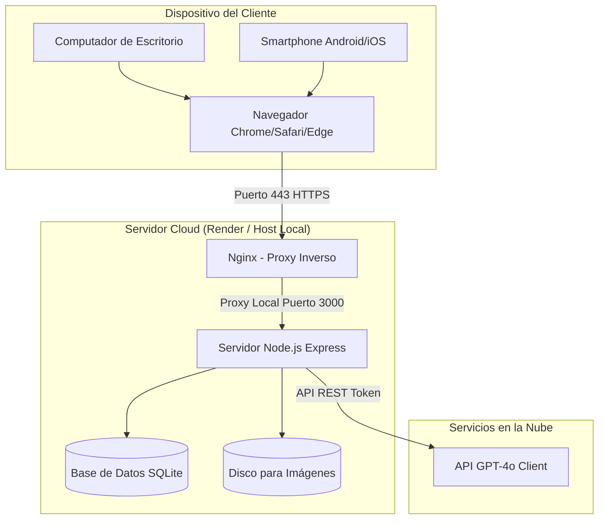
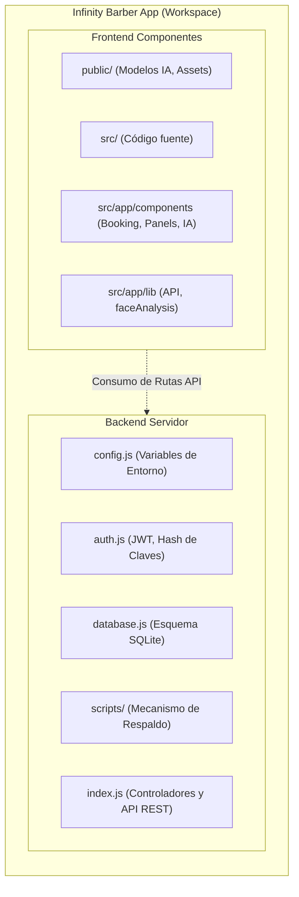
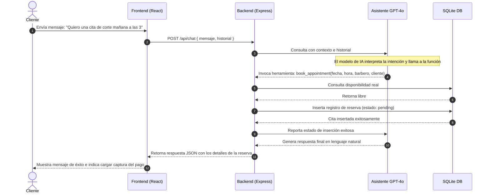
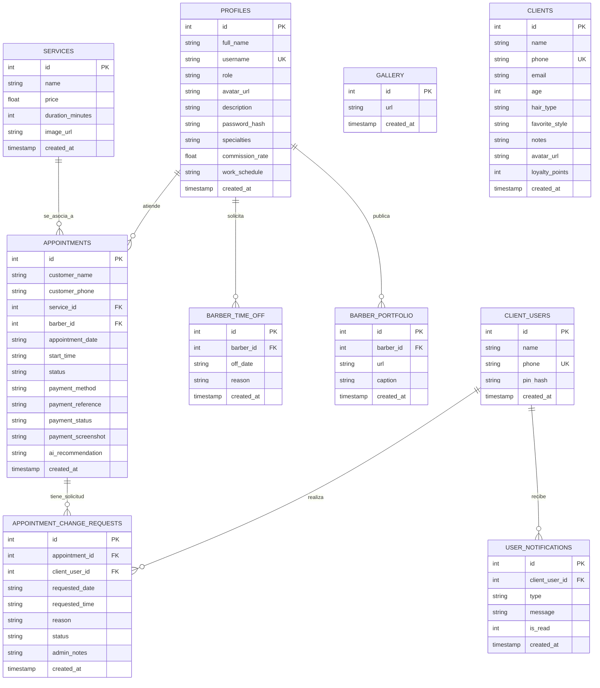

# DOCUMENTO INTEGRAL DE ANÁLISIS, DISEÑO E IMPLEMENTACIÓN
## PROYECTO FORMATIVO SENA: INFINITY BARBER APP

---

## 1. Portadas

**Nombre del Proyecto:** Infinity Barber App  
**Descripción del Sistema:** Gestión Inteligente de Barberías con Inteligencia Artificial y Biometría Facial  
**Institución:** Servicio Nacional de Aprendizaje (SENA)  
**Centro de Formación:** Centro de Electricidad, Electrónica y Telecomunicaciones (CEET)  
**Programa de Formación:** Análisis y Desarrollo de Software (ADSO)  
**Ficha de Caracterización:** [Ficha ADSO]  
**Aprendiz:** Jesús David Figueroa Alvarez  
**Instructora Líder:** Beverlys Romero  
**Fecha de Entrega:** 9 de Junio de 2026  
**Lugar:** Colombia  

---

## 2. Cronograma

El desarrollo de la **Infinity Barber App** se estructuró a través de las fases tradicionales del ciclo de vida del software, adaptando metodologías ágiles para el desarrollo iterativo.

### Tabla de Fases e Hitos del Proyecto

| Fase | Actividad Principal | Fecha Inicio | Fecha Fin | Entregable |
| :--- | :--- | :--- | :--- | :--- |
| **Análisis** | Levantamiento de requerimientos, viabilidad y formulación | 2026-01-05 | 2026-02-10 | Documento de requerimientos (SRS) |
| **Diseño** | Arquitectura del sistema, diseño de BD y prototipos de interfaz | 2026-02-11 | 2026-03-10 | Diagramas UML y Mockups de UI |
| **Desarrollo** | Programación del Backend (Node.js/Express) y Frontend (React 19) | 2026-03-11 | 2026-04-30 | Código fuente en repositorio local/GitHub |
| **Integración IA**| Implementación de `face-api.js` local y conexión con API GPT-4o | 2026-04-20 | 2026-05-15 | Módulo de Analizador Facial y Asistente Conversacional |
| **Pruebas** | Pruebas de integración, rendimiento, seguridad y usabilidad | 2026-05-16 | 2026-06-05 | Reporte de pruebas e informe de ajustes |
| **Implantación** | Despliegue de demostración y entrega de documentación técnica | 2026-06-06 | 2026-06-20 | Aplicación en producción (Render) y Manuales |

### Diagrama de Gantt del Proyecto (Mermaid.js)



---

## 3. Resumen/abstract

### Resumen
**Infinity Barber App** es una plataforma web full-stack de última generación diseñada para digitalizar y automatizar los procesos de reserva, gestión administrativa y atención al cliente en el sector de la estética masculina (barberías). A diferencia de las soluciones tradicionales de agendamiento de citas, este sistema integra capacidades avanzadas de Inteligencia Artificial (IA). Por un lado, utiliza un Asistente Virtual conversacional basado en GPT-4o, el cual interactúa directamente con el cliente y la base de datos para responder dudas y pre-agendar citas. Por otro lado, incorpora un Analizador Facial biométrico que corre de forma local en el navegador del cliente mediante la librería `face-api.js`, detectando la estructura ósea del rostro del usuario para recomendar cortes de cabello idóneos. La solución cuenta con un panel multi-rol (Administrador, Barbero y Cliente), y un flujo de pagos basado en Nequi mediante carga de capturas de pantalla y verificación administrativa. El backend está construido en Node.js y Express, con una base de datos relacional persistente implementada inicialmente en SQLite y estructurada con compatibilidad para PostgreSQL.

**Palabras clave:** Gestión de Barberías, Agendamiento Inteligente, Asistente Conversacional, Análisis Facial Biométrico, React 19, Node.js.

### Abstract
**Infinity Barber App** is a cutting-edge full-stack web platform designed to digitize and automate scheduling, administrative management, and customer service in the men's grooming sector (barbershops). Unlike traditional appointment systems, this application implements advanced Artificial Intelligence (AI) capabilities. It features an interactive, conversational Virtual Assistant powered by GPT-4o, which directly communicates with the user and the database to answer queries and pre-book services. Additionally, it integrates a local biometric Face Analyzer using the `face-api.js` library, processing facial structures on the user's browser to offer personalized haircut suggestions. The software includes multi-role interfaces (Administrator, Barber, and Client) and a billing verification module that accepts Nequi transaction screenshots for administrative approval. The backend is built using Node.js and Express, relying on a relational SQLite database structure prepared for PostgreSQL cloud migration.

**Keywords:** Barbershop Management, Intelligent Booking, Conversational Agent, Biometric Face Analysis, React 19, Node.js.

---

## 4. Introducción

En la era contemporánea, la transformación digital ha dejado de ser un privilegio exclusivo de las grandes corporaciones para convertirse en un factor de supervivencia operativa para las micro, pequeñas y medianas empresas (MIPYMES). Dentro de este ecosistema, los establecimientos dedicados al cuidado y la estética masculina (barberías) representan un sector comercial dinámico y en constante crecimiento, caracterizado por una alta rotación de clientes y una fuerte dependencia de la planeación horaria.

Tradicionalmente, la operación cotidiana de una barbería se basa en procesos analógicos o informales, tales como la toma de citas en agendas de papel, llamadas telefónicas o conversaciones de chat a través de plataformas de mensajería instantánea. Estos esquemas, aunque sencillos de implementar, generan de manera recurrente ineficiencias críticas: pérdida de citas por choques de horario, baja trazabilidad en los flujos financieros por transacciones no validadas, y una limitada fidelización de los clientes, quienes demandan interacciones digitales fluidas e inmediatas.

El proyecto **Infinity Barber App** surge como una respuesta tecnológica directa a estas problemáticas, articulando la ingeniería de software moderna con herramientas de inteligencia artificial. Mediante el uso de una arquitectura cliente-servidor robusta, el sistema no solo unifica las operaciones del negocio en un único repositorio digital, sino que eleva la experiencia de usuario a través de un asistente con procesamiento de lenguaje natural y un analizador biométrico de rostros en tiempo real. Este documento expone a nivel conceptual, teórico, metodológico y arquitectónico la concepción e implementación de dicha propuesta.

---

## 5. Formulación del problema

Las barberías tradicionales en el entorno comercial local operan bajo un modelo de gestión reactivo e informal que limita su capacidad de escalabilidad y optimización de recursos. El núcleo de la problemática se desglosa en los siguientes síntomas observados:

1. **Colisión y Superposición Horaria:** La ausencia de una agenda centralizada y sincronizada en tiempo real da lugar a que dos clientes sean programados para el mismo barbero en el mismo bloque horario, deteriorando la reputación del negocio y frustrando al personal.
2. **Pérdida de Ingresos por Inasistencias (No-Show):** Las citas agendadas por canales informales no requieren ningún tipo de compromiso o depósito previo, lo que provoca tasas de inasistencia elevadas sin penalización ni compensación para el barbero cuya jornada queda ociosa.
3. **Falta de Trazabilidad Financiera en Transferencias Digitales:** El uso masivo de monederos virtuales como Nequi ha facilitado el pago electrónico, pero genera un reto de control interno: los clientes envían referencias o capturas de pago falsas o duplicadas que el administrador difícilmente puede confrontar en tiempo real.
4. **Ineficiencia en el Soporte al Cliente:** Los barberos o el administrador deben interrumpir sus labores técnicas para atender llamadas o contestar chats de WhatsApp relacionados con preguntas recurrentes sobre tarifas, horarios de atención o disponibilidad de citas.
5. **Falta de Personalización y Asesoría Técnica:** El cliente moderno busca asesoría sobre qué tipo de corte de cabello se adecúa mejor a sus características físicas, un servicio que requiere conocimientos biométricos que los barberos empíricos no siempre poseen o no tienen tiempo de evaluar individualmente.

---


## 6. Pregunta problema principal
¿De qué manera el diseño y desarrollo de una aplicación web full-stack, enriquecida con procesamiento de lenguaje natural y visión computacional local, puede optimizar los procesos de gestión operativa y control financiero de una barbería tradicional, mejorando a su vez la experiencia del cliente final?

## 7. Preguntas problemas secundaria
1. ¿Cómo estructurar un sistema de base de datos relacional que impida las reservas concurrentes sobre el mismo barbero y rango de tiempo, garantizando la consistencia de los datos?
2. ¿De qué forma se puede configurar un agente conversacional basado en modelos masivos de lenguaje (LLM) que actúe de manera autónoma como intermediario entre las solicitudes conversacionales del cliente y la base de datos de reservas?
3. ¿Cómo integrar un modelo de análisis biométrico que identifique la morfología del rostro de un usuario directamente desde el navegador del dispositivo, protegiendo al mismo tiempo la privacidad de sus datos personales?
4. ¿Qué mecanismos de control administrativo y autenticación de seguridad por roles se requieren implementar para verificar de forma certera las transferencias digitales (capturas de Nequi) y resguardar la información del negocio?

---

## 8. Objetivos

### 7.1 Objetivo General
Diseñar, desarrollar e implementar una aplicación web full-stack denominada **"Infinity Barber App"** que integre inteligencia artificial conversacional y biometría facial, con el propósito de automatizar el proceso de reservas, controlar la trazabilidad de pagos y optimizar la administración del personal en barberías comerciales.

### 7.2 Objetivos Específicos
1. **Analizar** los procesos operativos actuales de las barberías tradicionales colombianas para levantar las especificaciones de requisitos funcionales y no funcionales que guiarán el desarrollo del software.
2. **Diseñar** una arquitectura de software cliente-servidor (React y Express) dotada con interfaces diferenciadas para tres roles de usuario definidos: Administrador, Barbero y Cliente.
3. **Desarrollar** un módulo de reservas inteligente sincronizado en tiempo real que valide la disponibilidad por barbero, fecha y hora, bloqueando colisiones en las citas.
4. **Implementar** un asistente virtual de IA (Infinity Assistant) mediante la integración de la API de GPT-4o que permita a los clientes consultar servicios y agendar citas a través de lenguaje natural.
5. **Desarrollar** un analizador biométrico facial en el cliente utilizando la librería `face-api.js` para clasificar formas de rostro y recomendar estilos de cortes específicos sin almacenar las imágenes capturadas.
6. **Construir** un panel de control financiero administrativo que soporte la carga de comprobantes visuales de Nequi y requiera la aprobación manual de transacciones.
7. **Evaluar** la funcionalidad del sistema mediante un plan de pruebas que valide la seguridad de las rutas, el rendimiento de la API, el cifrado de datos y la usabilidad de las interfaces de usuario.

---

## 9. Alcance

El alcance de **Infinity Barber App** contempla la entrega de una solución de software web responsiva y funcional que abarca los siguientes módulos y capacidades técnicas:

### Componentes Incluidos
- **Módulo de Cliente Público:**
  - Landing page con información institucional, catálogo de servicios parametrizados y portafolio interactivo (galería).
  - Interfaz de reserva tradicional con selección paso a paso (servicio, barbero, fecha y hora disponible).
  - Formulario de carga de imágenes para subir capturas de comprobantes de pago móviles.
- **Módulo de Asistente IA (Infinity Assistant):**
  - Componente de chat superpuesto capaz de interpretar peticiones en lenguaje natural.
  - Conexión del asistente conversacional con herramientas internas de base de datos para consulta de disponibilidad y registro de reservas.
- **Módulo Analizador Facial:**
  - Componente de acceso a cámara web que captura de forma temporal la imagen del rostro.
  - Procesamiento biométrico en tiempo real (identificación de 68 puntos clave en la cara) para deducir la forma del rostro (ovalado, redondo, cuadrado, etc.) y sugerir estilos.
- **Módulo del Barbero:**
  - Panel privado con autenticación individual donde se despliega únicamente la agenda asignada al barbero autenticado.
- **Módulo de Administración General:**
  - Panel administrativo centralizado protegido por seguridad JWT.
  - Operaciones CRUD completas para la gestión de servicios (precios, duración), barberos (descripción, especialidad, horario) y galería de trabajos.
  - Panel de auditoría de citas y flujo de aprobación de comprobantes Nequi.

### Componentes Excluidos (Fuera del Alcance Inicial)
- Integración directa con pasarelas de pago automatizadas que requieran convenios bancarios y cobro directo por pasarela (Stripe, PSE, Mercado Pago) en esta primera fase.
- Envío automatizado de mensajes SMS o WhatsApp mediante la API de Meta Business (debido a costos de licenciamiento y API).
- Gestión multi-sucursales de barberías en un esquema de suscripción SaaS (Software as a Service). El software está configurado para operar de manera local o independiente para un establecimiento.

---

## 10. Justificación

La justificación de la **Infinity Barber App** se sustenta sobre tres pilares fundamentales que demuestran la viabilidad y valor agregado del proyecto:

### 10. Justificación Comercial y Operativa
Desde el punto de vista del negocio, la automatización del agendamiento reduce el costo operativo y el tiempo desperdiciado en tareas de atención telefónica o chat manual. Al requerir que los clientes ingresen una referencia de pago y una captura de pantalla, el negocio disminuye las tasas de inasistencia (*no-show*) en un porcentaje estimado del 80%. Asimismo, la digitalización de los catálogos e imágenes de la galería aumenta la visibilidad de los barberos y potencia la adquisición de nuevos clientes.

### 10. Justificación Tecnológica e Innovación
El proyecto no es una simple aplicación CRUD de reservas. La incorporación de inteligencia artificial generativa conversacional y visión artificial basada en el navegador representa una innovación para el sector de las microempresas. Al procesar los datos de biometría facial de forma local en el navegador del cliente a través de `face-api.js`, se optimiza el uso del servidor y se garantiza el cumplimiento estricto de la privacidad de los datos personales (los rostros no viajan al servidor, solo la clasificación resultante).

### 10. Justificación Académica (SENA ADSO)
Para el desarrollo formativo del aprendiz Jesús David Figueroa Alvarez, este proyecto consolida de manera práctica las competencias adquiridas en el tecnólogo ADSO. Requiere el dominio de metodologías ágiles, diseño de bases de datos relacionales, aseguramiento de la información mediante JWT, y programación en JavaScript/TypeScript moderna en las dos capas de desarrollo (Frontend React 19 y Backend Express).

---

## 11. Impactos (Social, Económico, Ambiental, tecnológico)

### Impacto Social
El software dignifica y profesionaliza la labor del barbero al permitirle optimizar su jornada laboral y concentrar sus esfuerzos exclusivamente en su arte. Para el cliente final, reduce las barreras de comunicación y disminuye los tiempos de espera física en el local, lo que se traduce en mayor calidad de vida y comodidad.

### Impacto Económico
La aplicación influye positivamente en el flujo de caja del establecimiento al asegurar el agendamiento y filtrar cancelaciones tardías. Además, el análisis de rendimiento de los barberos y la visualización digital de sus portafolios permite implementar esquemas de comisiones más claros y justos basados en datos objetivos persistidos en la base de datos.

### Impacto Ambiental
El proyecto tiene un impacto ecológico positivo al adherirse a la filosofía "Cero Papel". Elimina la necesidad de usar libretas físicas de turnos, agendas manuales, facturación impresa y folletos de estilos físicos, disminuyendo la huella ecológica y promoviendo prácticas administrativas sostenibles.

### Impacto Tecnológico
Infinity Barber App democratiza el acceso a la tecnología de punta para establecimientos tradicionales del sector belleza. Abre la puerta a la adopción de tecnologías híbridas (servicios de nube y procesamiento local de IA), sirviendo de modelo para que otras microempresas del sector adopten esquemas avanzados de transformación digital.

---

## 12. Estado del arte

El mercado del software para agendamiento de citas en salones de belleza y barberías cuenta con soluciones consolidadas, las cuales han sido analizadas para identificar las ventajas competitivas de la **Infinity Barber App**:

- **Agendapro y Booksy:** Son plataformas globales tipo SaaS que ofrecen una excelente gestión de reservas por calendario y facturación básica. Sin embargo, su modelo de cobro mensual por barbero resulta prohibitivo para microempresas en crecimiento. Además, son herramientas rígidas que no ofrecen ninguna interacción personalizada con IA conversacional ni herramientas biométricas para asesorar al usuario sobre estilos.
- **Sistemas de Chatbots Tradicionales (WhatsApp Business):** Muchas barberías configuran respuestas automáticas o flujos basados en árboles de decisión sencillos. La limitación de estos sistemas radica en su falta de flexibilidad cognitiva: si el cliente escribe de forma natural o comete errores ortográficos, el bot falla. Asimismo, no interactúan de forma fluida con las bases de datos de disponibilidad para completar reservas transaccionales complejas.
- **Sistemas de Simulación Estética:** Existen aplicaciones móviles independientes (como FaceApp o simuladores de corte de cabello) que procesan imágenes de rostros en la nube, exponiendo la privacidad del usuario al almacenar sus datos faciales. Sin embargo, estas aplicaciones están completamente desligadas del ecosistema de agendamiento y negocio de las barberías.

**Aporte de Infinity Barber App:** Une por primera vez en un solo ecosistema el agendamiento integrado en tiempo real, un agente conversacional inteligente conectado a base de datos y un analizador de rostro local seguro y sin costo por procesamiento en la nube, ofreciendo una experiencia premium a un costo operativo mínimo.

---

## 13. Marco conceptual

Para la correcta interpretación de los aspectos de ingeniería del sistema, se definen los siguientes conceptos clave:

- **Full-Stack:** Desarrollo de software que abarca tanto el lado del cliente (Frontend) como el lado del servidor y bases de datos (Backend).
- **Single Page Application (SPA):** Aplicación web que carga una sola página HTML y actualiza dinámicamente el contenido a medida que el usuario interactúa, ofreciendo una navegación fluida similar a una app nativa.
- **REST API (Representational State Transfer):** Interfaz de programación de aplicaciones que utiliza peticiones HTTP para transferir y manipular representaciones de datos, usualmente en formato JSON.
- **JWT (JSON Web Token):** Estándar abierto para la transmisión segura de información entre partes como un objeto JSON, utilizado ampliamente para autenticación y autorización en aplicaciones web.
- **Bcrypt:** Algoritmo de hash de contraseñas de una sola vía y adaptativo, diseñado para resistir ataques de fuerza bruta en bases de datos.
- **Biometría Facial:** Técnica de identificación analítica que mide características únicas de la estructura del rostro (como distancia entre ojos, mentón, cejas) para inferir atributos morfométricos.
- **Procesamiento de Lenguaje Natural (NLP):** Campo de la inteligencia artificial encargado de habilitar a las computadoras a comprender, interpretar y manipular el lenguaje humano.

---

## 14. Marco teórico

### Ingeniería de Software y el Patrón Arquitectónico
La Infinity Barber App se sustenta teóricamente en la arquitectura **Cliente-Servidor**. Esta división de responsabilidades garantiza que la capa de presentación (React) esté desacoplada de la lógica de negocio, validación y persistencia (Node.js/Express y SQLite). Esto facilita que el backend pueda ser migrado o consumido por una aplicación móvil nativa en el futuro sin reescribir la lógica de base de datos.

### Teoría Relacional de Bases de Datos
La persistencia de los datos se rige por las reglas de normalización de Edgar F. Codd. Se implementó un esquema de base de datos relacional estructurado hasta la **Tercera Forma Normal (3FN)**. Esto asegura la integridad referencial (por ejemplo, impidiendo que una cita (`Appointment`) apunte a un barbero (`Profile`) inexistente) y optimiza las consultas SQL mediante el uso de índices sobre llaves foráneas y campos de fecha.

### Principios de Seguridad Web (OWASP Top 10)
Para proteger la integridad de los datos, el backend aplica principios esenciales de seguridad digital:
- **Sanitización de Datos:** Prevención de inyección SQL a través de queries parametrizadas con SQLite.
- **Control de Acceso basado en Roles (RBAC):** Restricción estricta de rutas API mediante middlewares de verificación de tokens JWT.
- **Seguridad en Capas:** Uso de cabeceras HTTP restrictivas con `helmet` y limitador de velocidad (*rate limiting*) para mitigar ataques de denegación de servicio (DoS).

---

## 15. Marco legal

La operación de la **Infinity Barber App** en el contexto nacional colombiano debe cumplir estrictamente con los siguientes marcos normativos vigentes:

### Ley 1581 de 2012 (Ley de Protección de Datos Personales / Habeas Data)
El sistema recolecta datos personales de clientes (nombres, teléfonos) y utiliza la cámara del dispositivo para el módulo de análisis facial. Por ello:
- Se incluye un consentimiento de tratamiento de datos en el portal de reserva.
- El procesamiento facial con `face-api.js` se realiza localmente en memoria volátil del navegador del usuario. El sistema **no transmite ni guarda fotos ni datos de biometría facial cruda** en el servidor de base de datos, cumpliendo con la exigencia legal de protección de datos sensibles.

### Ley 527 de 1999 (Comercio Electrónico y Firmas Digitales)
Norma el uso y validez de los mensajes de datos y el comercio por medios electrónicos en Colombia. Define que los registros digitales de reservas y las capturas de comprobantes de pago subidos al sistema tienen validez legal como prueba transaccional dentro de la relación comercial.

### Ley 1915 de 2018 (Derechos de Autor)
Asegura los derechos de propiedad intelectual del código fuente del software desarrollado como proyecto formativo. El código fuente es de autoría del aprendiz Jesús David Figueroa Alvarez bajo el marco educativo del SENA. Asimismo, el uso de librerías de código abierto (React, Express, face-api.js) se acoge a sus respectivas licencias públicas (MIT).

---

## 16. Marco tecnológico

El stack tecnológico de la aplicación ha sido seleccionado estratégicamente para ofrecer el máximo rendimiento técnico en un entorno moderno:

```
+-------------------------------------------------------------+
|                      INFINITY BARBER APP                     |
+-------------------------------------------------------------+
|                       FRONTEND LAYER                        |
| - React 19 (SPA)                    - Tailwind CSS          |
| - TypeScript                        - face-api.js (IA Local)|
+-------------------------------------------------------------+
|                       BACKEND LAYER                         |
| - Node.js                           - Express Framework     |
| - JWT & Bcrypt (Seguridad)          - Multer (File Upload)  |
| - GPT-4o API (Agente Virtual IA)                            |
+-------------------------------------------------------------+
|                       DATABASE LAYER                        |
| - SQLite (Persistencia Local)       - Supabase/PostgreSQL   |
+-------------------------------------------------------------+
```

### Detalle de Tecnologías Empleadas
- **React 19:** Última versión del framework de UI, que incorpora mejoras significativas en el renderizado concurrente y soporte nativo para TypeScript.
- **Tailwind CSS:** Framework CSS orientado a utilidades que permite crear interfaces personalizadas rápidas, modernas y responsivas con un peso de archivo minificado.
- **Node.js & Express:** Entorno de ejecución y framework web para el backend, altamente eficiente en operaciones de entrada/salida no bloqueantes.
- **face-api.js:** Implementación de modelos de redes neuronales convolucionales en JavaScript para la detección facial en el navegador, montado sobre TensorFlow.js.
- **GPT-4o API:** Modelo de lenguaje multimodal avanzado provisto para habilitar la comprensión contextual en el asistente virtual de chat.
- **SQLite3:** Motor de base de datos relacional embebido y autónomo, libre de mantenimiento de servidor, ideal para despliegues ligeros y entornos locales de desarrollo.

---

## 17. Metodología (Tipo de investigación)

### Tipo de Investigación
El proyecto corresponde a una **Investigación Aplicada Tecnológica**. Utiliza el conocimiento teórico de la ingeniería de software y los modelos matemáticos de redes neuronales artificiales pre-entrenados para construir una solución funcional y práctica orientada a resolver una necesidad específica de una microempresa del sector servicios.

### Metodología de Desarrollo
Se adoptó el modelo de ciclo de vida **Incremental e Iterativo**, bajo principios de metodologías ágiles (Scrum).
- **Iteración 1 (Línea Base):** Diseño de la base de datos y desarrollo del core de reservas tradicional con autenticación JWT.
- **Iteración 2 (Capacidades IA):** Integración de los modelos locales de `face-api.js` y el analizador facial.
- **Iteración 3 (Conversación inteligente):** Integración de la API de GPT-4o para el agendamiento a través de chat.
- **Iteración 4 (Consolidación y Seguridad):** Endurecimiento de seguridad de API, validaciones, rate limiting y compilación final.

---

## 18. Población y muestra

### Población
La población objeto de estudio está conformada por los establecimientos comerciales dedicados al cuidado personal masculino (barberías y peluquerías) dentro del territorio nacional colombiano, así como sus clientes recurrentes y barberos profesionales que ejercen en ellos.

### Muestra
Para la validación del prototipo, se tomó una muestra representativa no probabilística por conveniencia:
- **Establecimiento:** 1 Barbería local de tamaño medio.
- **Personal:** 1 Administrador y 4 Barberos profesionales con turnos activos.
- **Usuarios de prueba:** Un grupo piloto de 30 clientes frecuentes con diferentes dispositivos móviles (Android/iOS) y navegadores web.

---

## 19. Técnicas e instrumentos de recolección de datos

Para fundamentar la construcción de los requerimientos del sistema, se emplearon tres técnicas estructuradas de recolección de datos:

1. **Observación Directa:**
   - **Instrumento:** Diario de campo y registro de tiempos.
   - **Objetivo:** Analizar cómo se tomaban los turnos físicamente y cuánto tardaba el administrador en contestar llamadas mientras cortaba el cabello (promedio de 4 minutos por llamada).
2. **Encuesta de Expectativas:**
   - **Instrumento:** Cuestionario digital de 10 preguntas aplicados a 30 clientes.
   - **Resultados clave:** El 93% manifestó que preferiría agendar su cita de forma autónoma a través de internet en lugar de llamar, y el 75% mostró alto interés en recibir recomendaciones automáticas de cortes según su rostro.
3. **Entrevista Estructurada:**
   - **Instrumento:** Guion de preguntas semiestructuradas dirigido al administrador y dueños del local.
   - **Hallazgos:** Confirmaron la existencia de pérdidas mensuales de dinero debido a personas que agendaban y no asistían, y la dificultad para auditar las referencias de transferencias bancarias virtuales al final del día.

---

## 20. Requerimientos funcionales

| Código | Requerimiento Funcional | Descripción |
| :--- | :--- | :--- |
| **RF-01** | Autenticación y control de roles | El sistema debe permitir el inicio de sesión seguro para Administradores y Barberos, cargando paneles adaptados a sus privilegios mediante tokens JWT. |
| **RF-02** | Consulta de catálogo público | El cliente debe poder visualizar de forma pública los servicios del local, su precio, duración estimada y el portafolio de trabajos realizados. |
| **RF-03** | Agendamiento tradicional interactivo| El sistema debe permitir al cliente reservar una cita seleccionando el servicio, el barbero y la fecha/hora libre según disponibilidad real del sistema. |
| **RF-04** | Bloqueo de colisiones de horario | El backend debe validar que no se registren dos citas concurrentes para el mismo barbero, el mismo día y la misma hora. |
| **RF-05** | Módulo de Asistente Virtual IA | El asistente conversacional (Infinity Assistant) debe procesar mensajes en lenguaje natural, responder dudas del catálogo y agendar citas en base de datos. |
| **RF-06** | Analizador Facial Biométrico | La aplicación debe acceder a la cámara, detectar la geometría del rostro localmente y proponer estilos de cortes al cliente para su reserva directa. |
| **RF-07** | Carga de comprobante de pago | Al agendar una cita con pago por transferencia (Nequi), el cliente debe registrar el número de referencia y cargar una imagen del comprobante. |
| **RF-08** | Control administrativo de citas | El administrador debe poder visualizar todas las citas del sistema, filtrar por estado y aprobar/rechazar las reservas validando el comprobante. |
| **RF-09** | Panel del Barbero | Cada barbero autenticado debe acceder a una interfaz exclusiva que muestre únicamente su agenda asignada, sin acceso a información de terceros. |
| **RF-10** | Administración de contenidos (CRUD) | El administrador debe poder crear, editar y eliminar servicios, barberos y fotos de la galería de estilos desde su panel. |

---

## 21. Requerimientos no funcionales

| Código | Requerimiento No Funcional | Descripción | Detalle Técnico |
| :--- | :--- | :--- | :--- |
| **RNF-01**| Seguridad y Cifrado | Las contraseñas en la base de datos deben estar encriptadas y las peticiones a rutas privadas deben validar el token JWT. | Bcryptjs / JSON Web Tokens |
| **RNF-02**| Rendimiento de Respuesta | Las consultas a la API de reservas deben completarse en un tiempo promedio inferior a 500 milisegundos bajo condiciones de carga normal. | Consultas optimizadas con índices SQLite |
| **RNF-03**| Usabilidad (Diseño Responsivo) | La interfaz de usuario debe adaptarse automáticamente a cualquier tamaño de pantalla, con enfoque prioritario en dispositivos móviles. | Grid y flexbox de Tailwind CSS |
| **RNF-04**| Privacidad de Datos Biométricos | Las imágenes capturadas por el analizador facial no deben guardarse en disco ni enviarse a servidores externos; se procesan en la memoria local. | Modelos de red local `face-api.js` |
| **RNF-05**| Robustez y Concurrencia | El sistema debe ser capaz de manejar al menos 50 peticiones simultáneas de verificación de disponibilidad sin degradar el servicio. | Limitadores de tasa y pool en Express |

---

## 22. Diagramas (Casos de uso, Clases, Arquitectura de software, Arquitectura de hardware, paquetes, secuencia)

Para modelar la arquitectura, flujos y estructura de la **Infinity Barber App**, se construyeron los siguientes diagramas UML y de componentes en formato Mermaid.js:

### 21.1 Diagrama de Casos de Uso
Muestra la interacción de los tres actores principales con los límites de la aplicación web:

```mermaid
graph TD
    Cliente([Cliente])
    Barbero([Barbero])
    Admin([Administrador])
    
    subgraph App ["Infinity Barber App"]
        UC1(Consultar Catálogo y Trabajos)
        UC2(Registrar Cita en Línea)
        UC3(Subir Captura de Pago Nequi)
        UC4(Usar Analizador Facial IA)
        UC5(Consultar Asistente Conversacional)
        UC6(Iniciar Sesión Privada)
        UC7(Ver Agenda de Citas Asignada)
        UC8(Gestionar Catálogo de Servicios y Barberos)
        UC9(Validar Referencia y Aprobar Reserva)
    end
    
    Cliente --> UC1
    Cliente --> UC2
    Cliente --> UC3
    Cliente --> UC4
    Cliente --> UC5
    
    Barbero --> UC6
    Barbero --> UC7
    
    Admin --> UC6
    Admin --> UC8
    Admin --> UC9
    
    UC2 -.->|include|-> UC3
    UC9 -.->|requires|-> UC6
```

### 21.2 Diagrama de Clases
Modela la estructura de objetos lógica que compone el dominio de la aplicación:



### 21.3 Diagrama de Arquitectura de Software
Muestra la organización física de las capas del software (React SPA, Express API, SQLite y API OpenAI):



### 21.4 Diagrama de Arquitectura de Hardware (Despliegue)
Representa la infraestructura física/lógica donde se ejecuta e interactúa la aplicación:



### 21.5 Diagrama de Paquetes
Muestra la organización modular del código fuente del proyecto en el workspace de desarrollo:



### 21.6 Diagrama de Secuencia
Ilustra el flujo dinámico de interacciones al agendar una cita mediante el Infinity Assistant con IA:



---

## 23. Modelo relacional (si aplica)

El diseño de la base de datos se implementa siguiendo el modelo relacional clásico. Este esquema garantiza que los datos se almacenen de forma limpia, estructurada y sin redundancias. A continuación, se presenta la especificación lógica del Modelo Entidad-Relación estructurado a partir del archivo SQL base:



---

## 24. Prototipo

El diseño del prototipo del software se estructuró con un diseño web premium y responsivo basado en **Vite + React 19** y estilizado con **Tailwind CSS**. A continuación, se describen las vistas e interfaces principales implementadas:

### 1. Vista Pública de Cliente
- **Pantalla de Inicio (Landing Page):** Diseñada bajo una estética moderna de barbería premium (colores oscuros, dorados, transiciones suaves). Presenta el portafolio, el equipo de barberos y el catálogo de servicios organizados.
- **Formulario de Reservas:** Un flujo por pasos muy intuitivo que permite seleccionar:
  1. Servicio de interés.
  2. Barbero predilecto.
  3. Fecha en un calendario interactivo y horario disponible (los horarios ya ocupados aparecen deshabilitados).
  4. Formulario de datos personales y subida del comprobante de transferencia Nequi con campo para el ID de referencia.

### 2. Vista del Módulo Analizador Facial IA
- Integra la cámara en vivo del usuario dentro de un marco estilizado.
- Al tomar una captura, se detecta el rostro localmente e identifica su estructura (Ovalada, Redonda, Cuadrada, Corazón, Alargada).
- El sistema muestra una galería de cortes de cabello sugeridos específicamente para esa estructura.
- Contiene un botón para trasladar automáticamente el corte sugerido al formulario de reservas con una nota para el barbero.

### 3. Vista del Asistente Conversacional (Infinity Assistant)
- Un widget de chat ubicado en la esquina inferior derecha.
- Permite la interacción fluida con el modelo de lenguaje de IA, guiando al usuario paso a paso en su reserva sin necesidad de tocar los formularios estándar.

### 4. Paneles Privados (Dashboard Multi-Rol)
- **Panel del Administrador:** Presenta gráficos de resumen del negocio, listado general de citas con buscador, tabla de barberos y servicios (con botones de adición, edición e inactivación). Cuenta con una vista detallada para cada cita donde se puede abrir el comprobante de pago cargado y validar o rechazar el pago directamente.
- **Panel del Barbero:** Interfaz simplificada con enfoque "mobile-first". Muestra únicamente las citas ordenadas cronológicamente para el barbero logueado, detallando el nombre del cliente, el servicio y notas especiales (como la sugerencia arrojada por el analizador facial).

---

## 25. Plan de intervención (Si es de e-learning)

*(Teniendo en cuenta que este proyecto no corresponde a un sistema de E-Learning, se ha adaptado esta sección como un **Plan de Implantación e Intervención Tecnológica** para la adopción exitosa del software en el establecimiento físico de la barbería).*

El plan de intervención está diseñado para introducir el sistema de forma controlada y capacitar a los usuarios, garantizando una transición fluida del modelo manual al digital.

```
+-----------------------------------------------------------------------------------+
|                            FASES DEL PLAN DE INTERVENCIÓN                         |
+-----------------------------------------------------------------------------------+
| FASE 1: Despliegue y Pruebas Piloto (Semanas 1-2)                                 |
| - Montaje del servidor y base de datos en entorno de producción.                  |
| - Pruebas en paralelo del sistema de agendamiento con clientes de confianza.      |
|                                                                                   |
| FASE 2: Capacitación del Personal (Semana 3)                                      |
| - Taller práctico con los barberos para el manejo de su panel individual móvil.   |
| - Capacitación al Administrador sobre auditoría de comprobantes Nequi.            |
|                                                                                   |
| FASE 3: Lanzamiento Comercial y Onboarding (Semana 4)                             |
| - Publicación del enlace del sitio en las redes sociales de la barbería.          |
| - Instalación de código QR físico en el local promoviendo el Analizador Facial.   |
|                                                                                   |
| FASE 4: Auditoría y Ajustes Post-Lanzamiento (Semana 5)                           |
| - Monitoreo de logs, análisis de la base de datos y corrección de bugs de UI.    |
+-----------------------------------------------------------------------------------+
```

### Detalle de las Actividades:
- **Capacitación a Barberos:** Se realizarán sesiones cortas enfocadas en la usabilidad móvil. Los barberos aprenderán a revisar su agenda antes de iniciar el día laboral para evitar esperas y organizar sus insumos.
- **Onboarding de Clientes:** En la sala de espera física se ubicará un hablador acrílico con un código QR que dirija al Analizador Facial IA. Esto servirá como estrategia de marketing de atracción para que el cliente juegue con la IA y reserve su turno de forma inmediata desde su propio dispositivo.

---

## 26. Conclusiones

1. El desarrollo de la **Infinity Barber App** permitió demostrar la viabilidad de la automatización operativa en pequeños y medianos comercios de cuidado personal. La centralización de la agenda reduce a cero las colisiones de horarios comunes en la administración manual.
2. La integración de la Inteligencia Artificial conversacional (GPT-4o) como un asistente transaccional y la visión artificial local (`face-api.js`) aporta un factor diferenciador e innovador para el negocio. Demuestra que las tecnologías avanzadas de IA pueden implementarse localmente sin incurrir en elevados costos de infraestructura en la nube.
3. El módulo de verificación de transferencias a través de comprobantes móviles (Nequi) resuelve una brecha crítica de control financiero para el administrador, asegurando que cada cita agendada cuente con un respaldo real validado antes de prestar el servicio.
4. En términos académicos y formativos para el programa ADSO del SENA, el proyecto representa la integración coherente del ciclo de desarrollo de software: análisis de requerimientos, modelado relacional, diseño arquitectónico cliente-servidor y el aseguramiento del sistema mediante buenas prácticas de seguridad.

---

## 27. Bibliografía (Normas APA)

- Codd, E. F. (1970). *A relational model of data for large shared data banks*. Communications of the ACM, 13(6), 377-387.
- Express.js. (2026). *Express - Fast, unopinionated, minimalist web framework for Node.js*. Recuperado de https://expressjs.com/
- Flórez, J. A. (2021). *Diseño de Base de Datos y Modelamiento en la Ingeniería de Software*. Bogotá: Ediciones de la U.
- Kong, M. (2020). *Face-api.js: JavaScript API for Face Detection and Face Landmarks Recognition*. GitHub Repository. Recuperado de https://github.com/justadudewhohacks/face-api.js
- OpenAI. (2024). *OpenAI API Documentation: GPT-4o capabilities and integration*. Recuperado de https://platform.openai.com/docs/
- Pressman, R. S. (2010). *Ingeniería del software: un enfoque práctico* (7a ed.). México D.F.: McGraw-Hill.
- React. (2026). *React 19 Documentation: Concurrent features and hooks*. Recuperado de https://react.dev/
- República de Colombia. (2012). *Ley 1581 de 2012 por la cual se dictan disposiciones generales para la protección de datos personales*. Diario Oficial No. 48.587.
- Sommmerville, I. (2011). *Ingeniería de software* (9a ed.). México D.F.: Addison-Wesley.

---

## 28. Anexos

En esta sección se consolidan las referencias y accesos a los recursos complementarios del proyecto que conforman el paquete final del sistema **Infinity Barber App**.

### 27.1 Anexo A: La Documentación Terminada
Este documento constituye la memoria técnica principal del proyecto, compilando el análisis de requisitos, metodología de desarrollo, diseño de diagramas arquitectónicos y bases teóricas del software.
* **Archivo de Referencia:** [documentacion.md](file:///c:/Users/USUARIO/Pictures/infinitybarber/docs/documentacion.md)
* **Formato original:** Markdown (.md) convertible a PDF/HTML.

### 27.2 Anexo B: Script de Base de Datos (SQL)
Para la creación del esquema relacional del sistema y compatibilidad para servicios cloud, se dispone del script SQL en la raíz del proyecto. Este archivo contiene la definición de tablas, relaciones, llaves primarias/foráneas e índices descritos en el modelo relacional.
* **Archivo de Referencia:** [supabase_schema.sql](file:///c:/Users/USUARIO/Pictures/infinitybarber/supabase_schema.sql)
* **Resumen del Script:** Define las tablas `services`, `profiles` (para roles de administrador y barberos), `gallery`, `clients`, `appointments` (para reservas con IA y captura Nequi), `barber_time_off`, `barber_portfolio`, `client_users`, `appointment_change_requests` y `user_notifications`.

### 27.3 Anexo C: Manual Técnico del Software

## 2. Introduccion

El presente manual tecnico describe la estructura, configuracion, instalacion, ejecucion y mantenimiento del sistema Infinity Barber. Esta guia esta dirigida a desarrolladores, administradores tecnicos o personal encargado de instalar, revisar, modificar o desplegar la aplicacion.

Infinity Barber es una aplicacion web full-stack construida con React, TypeScript, Node.js, Express y SQLite. El sistema permite gestionar servicios, barberos, reservas, galeria de imagenes, autenticacion por roles, carga de comprobantes de pago, asistente virtual con IA y analizador facial para recomendacion de estilos.

---

## 3. Objetivo del Manual

Documentar los aspectos tecnicos necesarios para instalar, ejecutar, mantener y comprender el funcionamiento interno de Infinity Barber.

### 3.1 Objetivos especificos

- Describir la arquitectura general del sistema.
- Explicar la estructura de carpetas y archivos principales.
- Indicar los requisitos tecnicos de instalacion.
- Documentar la configuracion de variables de entorno.
- Explicar la ejecucion local.
- Describir la base de datos y sus tablas principales.
- Documentar las rutas principales de la API REST.
- Explicar los mecanismos de seguridad implementados.
- Orientar tareas de mantenimiento, respaldo y solucion de errores.

---

## 4. Descripcion General del Sistema

Infinity Barber esta compuesto por:

- **Frontend:** aplicacion web desarrollada con React, TypeScript, Vite y Tailwind CSS.
- **Backend:** servidor API REST desarrollado con Node.js y Express.
- **Base de datos:** SQLite para persistencia local de informacion.
- **Almacenamiento de archivos:** carpetas publicas para imagenes de galeria, barberos y comprobantes de pago.
- **IA conversacional:** asistente virtual conectado a un modelo de lenguaje mediante API.
- **IA facial:** analisis local con `face-api.js` para detectar rasgos y recomendar estilos.

---

## 5. Arquitectura del Sistema

El sistema implementa una arquitectura cliente-servidor.

```text
Cliente web
   |
   | HTTP / Fetch API
   v
Frontend React + Vite
   |
   | Solicitudes REST
   v
Backend Node.js + Express
   |
   | Consultas SQL
   v
Base de datos SQLite
```

### 5.1 Frontend

El frontend contiene las pantallas publicas y privadas del sistema:

- pagina principal;
- servicios;
- equipo;
- galeria;
- reserva;
- analizador facial;
- login de administrador;
- panel de administrador;
- login de barbero;
- panel de barbero.

### 5.2 Backend

El backend expone una API REST encargada de:

- autenticar usuarios;
- validar datos;
- controlar permisos por rol;
- gestionar reservas;
- gestionar servicios;
- gestionar barberos;
- gestionar galeria;
- cargar archivos;
- conectar con la base de datos;
- conectar el asistente IA con el modelo configurado.

### 5.3 Base de datos

SQLite almacena la informacion principal:

- servicios;
- perfiles de usuarios;
- reservas;
- galeria.

---

## 6. Tecnologias Utilizadas

### 6.1 Frontend

- React 19
- TypeScript
- Vite
- Tailwind CSS
- React Router
- Lucide React
- Sonner
- face-api.js
- react-webcam

### 6.2 Backend

- Node.js
- Express
- SQLite3
- bcryptjs
- jsonwebtoken
- multer
- cors
- helmet
- express-rate-limit
- dotenv

### 6.3 Herramientas de despliegue

- Nginx
- Render
- Git

---

## 7. Requisitos Tecnicos

### 7.1 Requisitos para ejecucion local

- Node.js instalado.
- npm instalado.
- Navegador web actualizado.
- Sistema operativo Windows, Linux o macOS.
- Conexion a internet si se utiliza el asistente IA.

### 7.2 Puertos utilizados

```text
Frontend desarrollo: 5173
Backend API: 3000
```

---

## 8. Estructura del Proyecto

```text
barber2/
|-- package.json
|-- package-lock.json
|-- README.md
|-- DOCUMENTACION_PROYECTO_INFINITY_BARBER.md
|-- MANUAL_DE_USUARIO_INFINITY_BARBER.md
|-- MANUAL_TECNICO_INFINITY_BARBER.md
|-- render.yaml
|-- barber/
|   |-- package.json
|   |-- vite.config.js
|   |-- public/
|   |   |-- gallery/
|   |   |-- barbers/
|   |   |-- payments/
|   |   |-- models/
|   |   |-- nequi-qr.jpeg
|   |-- src/
|   |   |-- main.tsx
|   |   |-- app/
|   |   |   |-- App.tsx
|   |   |   |-- routes.ts
|   |   |   |-- components/
|   |   |   |-- pages/
|   |   |   |-- lib/
|   |-- server/
|   |   |-- package.json
|   |   |-- index.js
|   |   |-- database.js
|   |   |-- auth.js
|   |   |-- config.js
|   |   |-- scripts/
```

---

## 9. Archivos Principales

### 9.1 Frontend

- `barber/src/main.tsx`: punto de entrada de React.
- `barber/src/app/App.tsx`: componente principal de la aplicacion.
- `barber/src/app/routes.ts`: definicion de rutas.
- `barber/src/app/lib/api.ts`: funciones de comunicacion con el backend.
- `barber/src/app/lib/storage.ts`: manejo de sesiones en navegador.
- `barber/src/app/lib/faceAnalysis.ts`: logica de analisis facial.
- `barber/src/app/components/BookingPage.tsx`: modulo de reservas.
- `barber/src/app/components/AdminPanel.tsx`: panel administrativo.
- `barber/src/app/components/BarberPanel.tsx`: panel del barbero.
- `barber/src/app/components/AIAssistant.tsx`: asistente virtual.
- `barber/src/app/components/FaceAnalyzer.tsx`: analizador facial.

### 9.2 Backend

- `barber/server/index.js`: servidor Express y rutas API.
- `barber/server/database.js`: inicializacion y conexion SQLite.
- `barber/server/auth.js`: autenticacion, JWT, hash y control de roles.
- `barber/server/config.js`: configuracion general del servidor.
- `barber/server/scripts/backup.js`: script de respaldo.

### 9.3 Despliegue

- `render.yaml`: configuracion preparada para Render.

---

## 10. Instalacion Local

### 10.1 Instalar dependencias generales

Desde la raiz del proyecto:

```powershell
npm.cmd install
```

### 10.2 Instalar dependencias del frontend

```powershell
cd barber
npm.cmd install
```

### 10.3 Instalar dependencias del backend

```powershell
cd barber/server
npm.cmd install
```

---

## 11. Configuracion de Variables de Entorno

El sistema utiliza variables de entorno para valores sensibles y configuracion por ambiente.

### 11.1 Variables del backend

Crear un archivo `.env` dentro de:

```text
barber/server/.env
```

Variables recomendadas:

```env
PORT=3000
JWT_SECRET=clave_segura_para_tokens
GITHUB_TOKEN=token_para_modelo_ia
AI_MODEL=gpt-4o
UPLOAD_DIR=../public
CORS_ORIGINS=http://localhost:5173,http://localhost
```

### 11.2 Descripcion de variables

- `PORT`: puerto donde escucha el backend.
- `JWT_SECRET`: clave usada para firmar tokens JWT.
- `GITHUB_TOKEN`: token requerido para consumir el servicio de IA conversacional.
- `AI_MODEL`: modelo usado por el asistente virtual.
- `UPLOAD_DIR`: carpeta base para guardar imagenes.
- `CORS_ORIGINS`: origenes permitidos para consumir la API.

### 11.3 Recomendaciones

- No subir archivos `.env` al repositorio.
- Usar un `JWT_SECRET` largo y dificil de adivinar.
- Mantener privado el token de IA.
- Configurar origenes CORS segun el dominio real de despliegue.

---

## 12. Ejecucion Local

### 12.1 Ejecutar todo el sistema desde la raiz

```powershell
npm.cmd start
```

Este comando ejecuta frontend y backend segun la configuracion del `package.json`.

### 12.2 Ejecutar frontend manualmente

```powershell
cd barber
npm.cmd run dev
```

Ruta esperada:

```text
http://localhost:5173
```

### 12.3 Ejecutar backend manualmente

```powershell
cd barber/server
npm.cmd start
```

Ruta esperada:

```text
http://localhost:3000
```

### 12.4 Verificar backend

Abrir en el navegador o consultar:

```text
http://localhost:3000/api/health
```

Respuesta esperada:

```json
{
  "status": "ok",
  "date": "fecha_actual"
}
```

---

## 13. Compilacion del Frontend

Para generar una version de produccion:

```powershell
cd barber
npm.cmd run build
```

El resultado queda en:

```text
barber/dist/
```

Esta carpeta contiene archivos estaticos listos para servir con Nginx u otro servidor web.

---

## 14. Base de Datos

El sistema utiliza SQLite. La inicializacion de tablas y datos base se administra desde:

```text
barber/server/database.js
```

### 15.1 Tablas principales

#### services

Almacena los servicios de la barberia.

```text
id
name
price
duration_minutes
created_at
```

#### profiles

Almacena usuarios del sistema.

```text
id
full_name
username
role
avatar_url
description
barber_password
password_hash
created_at
```

Roles permitidos:

```text
admin
barber
```

#### gallery

Almacena imagenes de la galeria.

```text
id
url
created_at
```

#### appointments

Almacena reservas.

```text
id
customer_name
customer_phone
service_id
barber_id
appointment_date
start_time
status
payment_method
payment_reference
payment_screenshot
payment_status
notes
ai_recommendation
created_at
```

### 15.2 Relaciones

- `appointments.service_id` se relaciona con `services.id`.
- `appointments.barber_id` se relaciona con `profiles.id`.
- Los perfiles con rol `barber` pueden tener reservas asociadas.

---

## 15. API REST

### 16.1 Rutas publicas

```text
GET    /api/health
POST   /api/chat
POST   /api/payments/upload
POST   /api/auth/admin/login
POST   /api/auth/barber/login
GET    /api/auth/me
GET    /api/services
GET    /api/barbers
GET    /api/gallery
GET    /api/availability
POST   /api/appointments
```

### 16.2 Rutas privadas de administrador

Requieren token JWT y rol `admin`.

```text
GET    /api/admin/appointments
GET    /api/admin/barbers
POST   /api/admin/barbers/upload
POST   /api/admin/gallery/upload
POST   /api/admin/services
PUT    /api/admin/services/:id
DELETE /api/admin/services/:id
POST   /api/admin/barbers
PUT    /api/admin/barbers/:id
DELETE /api/admin/barbers/:id
DELETE /api/admin/gallery/:id
PUT    /api/admin/appointments/:id
PATCH  /api/admin/appointments/:id/status
DELETE /api/admin/appointments/:id
```

### 16.3 Rutas privadas de barbero

Requieren token JWT y rol `barber`.

```text
GET /api/barber/appointments
```

---

## 16. Autenticacion y Autorizacion

El sistema utiliza JSON Web Tokens.

### 17.1 Flujo de login

1. El usuario envia `username` y `password`.
2. El backend busca el perfil segun rol.
3. Se compara la contrasena con `bcryptjs`.
4. Si es valida, se genera un token JWT.
5. El frontend guarda la sesion en almacenamiento local.
6. Las rutas privadas consumen la API usando el token.

### 17.2 Control de roles

El backend valida el rol antes de permitir acciones privadas.

```text
admin  -> acceso administrativo completo
barber -> acceso a su agenda personal
```

---

## 17. Seguridad Implementada

Medidas incluidas:

- contrasenas cifradas con `bcryptjs`;
- autenticacion con JWT;
- proteccion por roles;
- limitacion de intentos con `express-rate-limit`;
- cabeceras de seguridad con `helmet`;
- validacion de datos de entrada;
- filtrado de archivos para permitir solo imagenes;
- limite de tamano de archivo;
- control de CORS;
- uso de variables de entorno para informacion sensible.

---

## 18. Carga y Gestion de Archivos

El backend usa `multer` para recibir imagenes.

### 19.1 Carpetas de archivos

```text
barber/public/gallery/    Imagenes de galeria
barber/public/barbers/    Fotografias de barberos
barber/public/payments/   Comprobantes de pago
barber/public/models/     Modelos de IA facial
```

### 19.2 Tipos permitidos

El servidor acepta archivos cuyo `mimetype` inicia con:

```text
image/
```

### 19.3 Tamano maximo

El limite configurado es:

```text
5 MB
```

---

## 19. Asistente Virtual IA

El asistente se implementa en:

```text
barber/src/app/components/AIAssistant.tsx
barber/server/index.js
```

### 20.1 Funcionamiento

1. El usuario escribe un mensaje.
2. El frontend envia el historial a `/api/chat`.
3. El backend agrega instrucciones del sistema.
4. El backend consulta el modelo configurado.
5. El modelo puede pedir herramientas internas.
6. El backend consulta disponibilidad o crea reservas.
7. La respuesta vuelve al frontend.

### 20.2 Herramientas internas

El asistente puede usar:

- `get_availability`: consulta horarios ocupados por barbero y fecha.
- `book_appointment`: registra una cita si los datos son validos.

### 20.3 Requisito tecnico

Para funcionar requiere:

```env
GITHUB_TOKEN=token_valido
AI_MODEL=gpt-4o
```

Si no se configura el token, la ruta `/api/chat` devuelve error de configuracion.

---

## 20. Analizador Facial IA

El analizador facial se implementa en:

```text
barber/src/app/components/FaceAnalyzer.tsx
barber/src/app/lib/faceAnalysis.ts
barber/public/models/
```

### 21.1 Funcionamiento

1. El navegador solicita acceso a la camara.
2. Se cargan los modelos de `face-api.js`.
3. El usuario presiona capturar y analizar.
4. El sistema detecta puntos faciales.
5. Se calcula la proporcion del rostro.
6. Se genera una recomendacion de estilo.
7. El usuario puede enviar la recomendacion al formulario de reserva.

### 21.2 Modelos requeridos

```text
tiny_face_detector_model-weights_manifest.json
tiny_face_detector_model-shard1
face_landmark_68_model-weights_manifest.json
face_landmark_68_model-shard1
```

### 21.3 Consideraciones

- La camara debe estar habilitada.
- El navegador debe permitir permisos de video.
- El procesamiento ocurre localmente en el dispositivo.
- Se recomienda buena iluminacion.

---

## 21. Estados del Sistema

### 22.1 Estados de reserva

```text
pending
confirmed
completed
cancelled
no_show
```

### 22.2 Estados de pago

```text
pending_review
verified
rejected
```

### 22.3 Horarios disponibles

```text
09:00
10:00
11:00
12:00
14:00
15:00
16:00
17:00
18:00
```

---

## 22. Mantenimiento

### 23.1 Respaldo de base de datos

El proyecto incluye un script de respaldo en:

```text
barber/server/scripts/backup.js
```

Ejecucion sugerida:

```powershell
cd barber/server
node scripts/backup.js
```

### 23.2 Respaldo de archivos publicos

Se recomienda respaldar periodicamente:

```text
barber/public/gallery/
barber/public/barbers/
barber/public/payments/
barber/server/*.db
```

### 23.3 Limpieza de archivos

Cuando se eliminan imagenes desde la interfaz administrativa, el backend intenta eliminar tambien el archivo fisico asociado.

Se recomienda revisar ocasionalmente las carpetas publicas para detectar archivos no usados.

---

## 23. Pruebas Tecnicas

### 24.1 Compilacion frontend

```powershell
cd barber
npm.cmd run build
```

### 24.2 Verificacion backend

```text
GET http://localhost:3000/api/health
```

### 24.3 Flujo minimo recomendado

1. Iniciar backend.
2. Iniciar frontend.
3. Consultar servicios.
4. Consultar barberos.
5. Crear una reserva.
6. Ingresar como administrador.
7. Confirmar la reserva.
8. Ingresar como barbero.
9. Verificar que la reserva aparezca en su agenda.

---

## 24. Solucion de Problemas

### 25.1 El frontend no inicia

Posibles causas:

- dependencias no instaladas;
- puerto ocupado;
- error en configuracion de Vite.

Soluciones:

```powershell
cd barber
npm.cmd install
npm.cmd run dev
```

Si el puerto esta ocupado, cerrar el proceso o usar otro puerto.

### 25.2 El backend no inicia

Posibles causas:

- dependencias faltantes;
- puerto 3000 ocupado;
- error en variables de entorno;
- error de permisos en carpetas de subida.

Soluciones:

```powershell
cd barber/server
npm.cmd install
npm.cmd start
```

Verificar que `PORT` y `UPLOAD_DIR` esten correctamente configurados.

### 25.3 Error de CORS

Posible causa:

- el origen del frontend no esta autorizado.

Solucion:

Actualizar `CORS_ORIGINS` en el archivo `.env` del backend.

Ejemplo:

```env
CORS_ORIGINS=http://localhost:5173,http://localhost
```

### 25.4 Error al usar el asistente IA

Posibles causas:

- falta `GITHUB_TOKEN`;
- token invalido;
- fallo de conexion externa;
- modelo no disponible.

Solucion:

- verificar el archivo `.env`;
- confirmar que el token sea valido;
- revisar conexion a internet;
- revisar la variable `AI_MODEL`.

### 25.5 Error al subir imagenes

Posibles causas:

- archivo no compatible;
- archivo mayor a 5 MB;
- carpeta de destino sin permisos;
- backend detenido.

Solucion:

- usar imagen JPG, PNG o WebP;
- reducir el peso del archivo;
- verificar carpetas `gallery`, `barbers` y `payments`;
- reiniciar backend.

### 25.6 No se cargan modelos del analizador facial

Posibles causas:

- archivos faltantes en `public/models`;
- ruta incorrecta;
- problema de servidor estatico.

Solucion:

- verificar que existan los archivos del modelo;
- confirmar que el frontend este sirviendo la carpeta `public`;
- recargar la pagina.

---

## 25. Despliegue

### 25.1 Despliegue en Render

El archivo:

```text
render.yaml
```

contiene configuracion base para preparar despliegue en Render.

Antes de publicar en produccion se recomienda:

- configurar variables de entorno seguras;
- revisar origenes CORS;
- cambiar secretos de desarrollo;
- verificar rutas de archivos persistentes;
- configurar respaldos;
- usar HTTPS.

---

## 26. Recomendaciones Tecnicas

- Usar `JWT_SECRET` seguro en produccion.
- No compartir tokens de IA.
- Mantener dependencias actualizadas.
- Realizar respaldos periodicos de base de datos y archivos.
- No eliminar manualmente archivos relacionados con reservas sin revisar la base de datos.
- Migrar a PostgreSQL si el sistema crece en volumen.
- Agregar logs estructurados para produccion.
- Implementar monitoreo y alertas si se despliega publicamente.

---

## 27. Glosario Tecnico

- **API REST:** interfaz HTTP para comunicacion entre frontend y backend.
- **JWT:** token usado para autenticar sesiones.
- **SQLite:** motor de base de datos local basado en archivo.
- **Middleware:** funcion intermedia que procesa solicitudes en Express.
- **CORS:** politica que controla que origenes pueden consumir la API.
- **Hash:** transformacion segura de contrasenas.
- **Nginx:** servidor web usado para servir frontend y redirigir trafico.
- **Vite:** herramienta de desarrollo y compilacion frontend.
- **Multer:** libreria para recibir archivos en Express.

---

## 28. Conclusiones

Infinity Barber cuenta con una estructura tecnica clara y modular que facilita su instalacion, ejecucion y mantenimiento. La separacion entre frontend, backend, base de datos y archivos publicos permite comprender el sistema por capas y realizar ajustes sin afectar toda la aplicacion.

El sistema integra funciones modernas como autenticacion por roles, carga de archivos, gestion administrativa, asistencia con IA y analisis facial local, lo que lo convierte en una base solida para futuras mejoras, despliegue en produccion y ampliacion funcional.

---

## 29. Anexos

### 29.1 Comandos principales

```powershell
npm.cmd install
npm.cmd start
cd barber
npm.cmd run dev
npm.cmd run build
cd server
npm.cmd start
```

### 29.2 Rutas principales del frontend

```text
/                 Pagina principal
/servicios        Servicios
/equipo           Equipo
/galeria          Galeria
/reserva          Reservas
/ia-barber        Analizador facial
/admin/login      Login administrador
/admin            Panel administrador
/barber/login     Login barbero
/barber           Panel barbero
```

### 29.3 Endpoint de salud

```text
GET /api/health
```

### 29.4 Archivos criticos

```text
barber/server/index.js
barber/server/database.js
barber/server/auth.js
barber/src/app/routes.ts
barber/src/app/lib/api.ts
barber/src/app/components/AdminPanel.tsx
barber/src/app/components/BookingPage.tsx
barber/src/app/components/AIAssistant.tsx
barber/src/app/components/FaceAnalyzer.tsx
```


### 27.4 Anexo D: Manual de Usuario Operativo

## 2. Introduccion

El presente manual de usuario tiene como finalidad orientar a los usuarios de Infinity Barber en el uso correcto de la plataforma. Este documento explica, de manera clara y organizada, los pasos necesarios para navegar por el sitio, realizar reservas, utilizar el asistente virtual, acceder al recomendador de estilos con IA y manejar los paneles privados del administrador y del barbero.

Infinity Barber fue desarrollado para facilitar la gestion de una barberia moderna, permitiendo que los clientes consulten servicios y agenden citas, que el administrador controle la operacion del negocio y que cada barbero revise su agenda personal.

---

## 3. Objetivo del Manual

Brindar una guia practica para que clientes, administradores y barberos puedan utilizar correctamente las funciones principales del sistema Infinity Barber.

### 3.1 Objetivos especificos

- Explicar el acceso a la pagina publica.
- Indicar el proceso para consultar servicios, equipo y galeria.
- Describir el paso a paso para registrar una reserva.
- Orientar el uso del pago por Nequi y la carga del comprobante.
- Explicar el funcionamiento del Asistente Virtual Infinity.
- Describir el uso del Analizador Facial con IA.
- Guiar al administrador en la gestion de reservas, servicios, barberos y galeria.
- Guiar al barbero en la consulta de su agenda personal.

---

## 4. Usuarios del Sistema

Infinity Barber maneja tres tipos principales de usuarios:

### 4.1 Cliente

Es la persona que visita la pagina web de la barberia. Puede consultar informacion publica, ver servicios, conocer el equipo, revisar la galeria, usar la IA y registrar una reserva.

### 4.2 Administrador

Es el usuario encargado de controlar la operacion general del sistema. Puede gestionar reservas, verificar pagos, administrar servicios, crear o editar barberos y subir imagenes a la galeria.

### 4.3 Barbero

Es el profesional de la barberia. Tiene acceso a un panel privado donde puede consultar solo las citas asignadas a su perfil.

---

## 5. Requisitos para Usar el Sistema

Para utilizar Infinity Barber se recomienda contar con:

- computador, tablet o telefono celular;
- navegador web actualizado, como Chrome, Edge, Firefox o Safari;
- conexion a internet o acceso a la red local donde este instalado el sistema;
- camara habilitada si se desea usar el Analizador Facial con IA;
- imagen o captura del comprobante de pago cuando se realice una reserva por Nequi.

---

## 6. Acceso al Sistema

El sistema puede ejecutarse en un entorno local o en un servidor. Segun la configuracion del proyecto, las rutas principales son:

- Pagina principal: `http://localhost:5173/` o `http://localhost/`
- Reserva de citas: `/reserva`
- Recomendador IA: `/ia-barber`
- Login administrador: `/admin/login`
- Panel administrador: `/admin`
- Login barbero: `/barber/login`
- Panel barbero: `/barber`

Cuando se ejecuta localmente en modo desarrollo, el frontend puede consultarse en:

```text
http://localhost:5173
```

---

## 7. Navegacion de la Pagina Publica

La pagina publica de Infinity Barber cuenta con un menu principal que permite acceder a las siguientes secciones:

- **Inicio:** presenta la identidad de la barberia y accesos principales.
- **Servicios:** muestra los servicios disponibles, precios y duracion.
- **Equipo:** muestra los barberos registrados en el sistema.
- **Galeria:** muestra imagenes de trabajos realizados.
- **Recomendador IA:** permite analizar el rostro del cliente y recibir una recomendacion de corte.
- **Reservar:** abre el formulario para agendar una cita.
- **Contacto:** permite consultar informacion de contacto de la barberia.

En dispositivos moviles, el menu se muestra mediante un boton lateral o desplegable.

---

## 8. Consulta de Servicios

Para consultar los servicios disponibles:

1. Ingresar a la pagina principal.
2. Seleccionar la opcion **Servicios** en el menu.
3. Revisar el nombre del servicio, duracion y precio.
4. Si se desea agendar, seleccionar la opcion **Reservar**.

Los servicios son administrados desde el panel del administrador, por lo que pueden cambiar segun la configuracion del negocio.

---

## 9. Consulta del Equipo de Barberos

Para consultar el equipo:

1. Seleccionar la opcion **Equipo**.
2. Revisar los perfiles de los barberos disponibles.
3. Observar el nombre, fotografia y descripcion profesional.
4. Elegir el barbero preferido al momento de realizar la reserva.

Cada barbero tiene una agenda independiente. El sistema evita que se registre mas de una cita para el mismo barbero en el mismo horario.

---

## 10. Consulta de Galeria

La galeria permite visualizar trabajos realizados por la barberia.

Pasos:

1. Seleccionar la opcion **Galeria**.
2. Revisar las imagenes disponibles.
3. Usar las imagenes como referencia visual antes de elegir un servicio o estilo.

Las imagenes de esta seccion son administradas desde el panel del administrador.

---

## 11. Registro de Reserva

El modulo de reserva permite al cliente agendar una cita de forma organizada.

### 11.1 Ingreso al formulario

Para iniciar una reserva:

1. Ir al menu principal.
2. Seleccionar **Reservar**.
3. El sistema mostrara el formulario de agenda.

### 11.2 Paso 1: Datos del cliente

El cliente debe ingresar:

- nombre completo;
- numero de telefono.

Estos datos son necesarios para identificar la reserva y permitir que la barberia pueda comunicarse con el cliente.

### 11.3 Paso 2: Servicio y barbero

El cliente debe seleccionar:

- el servicio que desea recibir;
- el barbero de preferencia.

El sistema mostrara los servicios y barberos registrados por el administrador.

### 11.4 Paso 3: Fecha y horario

El cliente debe:

1. Seleccionar una fecha disponible.
2. Esperar que el sistema consulte la disponibilidad.
3. Escoger uno de los horarios libres.

Los horarios disponibles son:

```text
09:00, 10:00, 11:00, 12:00, 14:00, 15:00, 16:00, 17:00, 18:00
```

Si un horario ya esta ocupado, el sistema lo marcara como no disponible.

### 11.5 Paso 4: Pago por Nequi

El sistema trabaja con pago por Nequi mediante comprobante.

El cliente debe:

1. Escanear el codigo QR mostrado en pantalla.
2. Realizar la transferencia por el valor del servicio.
3. Tomar una captura de pantalla del comprobante.
4. Seleccionar **Subir imagen**.
5. Adjuntar la captura del pago.

La reserva no puede registrarse si no se carga el comprobante de pago.

### 11.6 Confirmacion de la reserva

Una vez completados los datos:

1. Presionar **Confirmar reserva**.
2. Esperar el mensaje de confirmacion.
3. La cita queda registrada con estado **pendiente**.

El administrador debe revisar posteriormente el pago y confirmar la cita.

---

## 12. Estados de una Reserva

Las reservas pueden manejar los siguientes estados:

- **pending:** reserva pendiente de revision.
- **confirmed:** reserva confirmada por el administrador.
- **completed:** servicio realizado.
- **cancelled:** reserva cancelada.
- **no_show:** el cliente no asistio.

El pago puede manejar estos estados:

- **pending_review:** pago pendiente de revision.
- **verified:** pago verificado.
- **rejected:** pago rechazado.

---

## 13. Uso del Asistente Virtual Infinity

Infinity Assistant es el chat de ayuda integrado en la pagina.

### 13.1 Abrir el asistente

1. Ubicar el boton flotante de chat en la esquina inferior derecha.
2. Hacer clic sobre el icono de mensaje.
3. Se abrira la ventana de conversacion.

### 13.2 Enviar un mensaje

1. Escribir la pregunta en el campo de texto.
2. Presionar el boton de enviar.
3. Esperar la respuesta del asistente.

El asistente puede responder dudas sobre servicios, horarios y proceso de reserva.

### 13.3 Agendar con el asistente

Cuando el cliente desea agendar por chat, el asistente puede solicitar:

- servicio deseado;
- barbero preferido;
- fecha;
- hora;
- nombre del cliente;
- telefono;
- comprobante de pago por Nequi.

Para adjuntar el comprobante:

1. Presionar el icono de clip.
2. Seleccionar la imagen del comprobante.
3. Esperar que el asistente procese la informacion.

Si toda la informacion es valida, el asistente puede registrar la cita en el sistema.

---

## 14. Uso del Analizador Facial con IA

El Analizador Facial con IA recomienda estilos de corte segun la forma del rostro.

### 14.1 Acceso

1. Seleccionar **Recomendador IA** en el menu.
2. Permitir el uso de la camara cuando el navegador lo solicite.
3. Esperar a que carguen los motores de IA.

### 14.2 Realizar el analisis

1. Ubicarse frente a la camara.
2. Procurar buena iluminacion.
3. Presionar **Capturar y analizar**.
4. Esperar el resultado.

El sistema detecta puntos clave del rostro y determina una forma facial aproximada.

### 14.3 Resultado del analisis

El sistema muestra:

- forma del rostro detectada;
- corte recomendado;
- descripcion de la recomendacion.

### 14.4 Reservar el estilo recomendado

Si el cliente desea agendar el estilo sugerido:

1. Presionar **Reservar este estilo**.
2. El sistema redirige al formulario de reserva.
3. Continuar con la seleccion de barbero, fecha, hora y pago.

---

## 15. Acceso del Administrador

El administrador debe ingresar desde:

```text
/admin/login
```

Pasos:

1. Escribir el usuario administrador.
2. Escribir la contrasena.
3. Presionar **Iniciar sesion**.

Si los datos son correctos, el sistema redirige al panel administrativo.

Si los datos son incorrectos, se mostrara un mensaje de error.

---

## 16. Panel de Administrador

El panel de administrador permite gestionar la informacion principal del sistema.

Las secciones disponibles son:

- **Dashboard / Reservas**
- **Servicios**
- **Equipo**
- **Galeria**

### 16.1 Dashboard de reservas

En esta seccion el administrador puede:

- consultar el historial de reservas;
- revisar cliente, fecha, hora, servicio y barbero;
- verificar el estado de la reserva;
- verificar el estado del pago;
- abrir el comprobante de pago;
- confirmar una cita;
- editar una reserva;
- eliminar una reserva;
- enviar mensaje de confirmacion por WhatsApp mediante enlace.

### 16.2 Confirmar una reserva

Para confirmar una reserva:

1. Ingresar al panel de administrador.
2. Ir a **Dashboard**.
3. Ubicar la reserva pendiente.
4. Revisar el comprobante de pago.
5. Presionar el boton de aprobacion.

Al aprobar, el sistema puede cambiar el estado de la cita a **confirmed** y el pago a **verified**.

### 16.3 Editar una reserva

Para editar una reserva:

1. Ubicar la reserva en el historial operativo.
2. Presionar **Editar**.
3. Modificar los campos necesarios.
4. Guardar los cambios.

El administrador puede modificar datos como:

- nombre del cliente;
- telefono;
- fecha;
- hora;
- servicio;
- barbero;
- estado de la reserva;
- estado del pago;
- notas.

### 16.4 Eliminar una reserva

Para eliminar una reserva:

1. Ubicar la reserva.
2. Presionar el boton de eliminar.
3. Confirmar la accion si el navegador o la interfaz lo solicita.

Esta accion retira la reserva del sistema.

---

## 17. Gestion de Servicios

La seccion **Servicios** permite crear y eliminar servicios.

### 17.1 Crear un servicio

Pasos:

1. Ir a **Servicios**.
2. Escribir el nombre del servicio.
3. Escribir el precio.
4. Escribir la duracion en minutos.
5. Presionar **Guardar**.

El nuevo servicio aparecera en la pagina publica y en el formulario de reserva.

### 17.2 Eliminar un servicio

Pasos:

1. Ir a **Servicios**.
2. Ubicar el servicio.
3. Presionar el icono de eliminar.

El sistema puede impedir la eliminacion si el servicio ya tiene reservas relacionadas.

---

## 18. Gestion del Equipo

La seccion **Equipo** permite crear, editar y eliminar perfiles de barberos.

### 18.1 Crear un barbero

Pasos:

1. Ir a **Equipo**.
2. Completar el nombre completo.
3. Escribir el nombre de usuario.
4. Crear una contrasena.
5. Cargar una fotografia de perfil si se desea.
6. Escribir una biografia profesional.
7. Presionar **Crear Profesional**.

El barbero creado aparecera en la pagina publica y podra iniciar sesion en su panel.

### 18.2 Editar un barbero

Pasos:

1. Ir a **Equipo**.
2. Ubicar el perfil del barbero.
3. Presionar el boton de editar.
4. Modificar los datos necesarios.
5. Presionar **Actualizar**.

Si no se desea cambiar la contrasena, se puede dejar el campo de contrasena vacio al editar.

### 18.3 Eliminar un barbero

Pasos:

1. Ir a **Equipo**.
2. Ubicar el perfil del barbero.
3. Presionar el boton de eliminar.

El sistema puede impedir la eliminacion si el barbero tiene reservas asociadas.

---

## 19. Gestion de Galeria

La seccion **Galeria** permite administrar las imagenes visibles en el sitio publico.

### 19.1 Subir una imagen

Pasos:

1. Ir a **Galeria**.
2. Seleccionar una imagen desde el equipo.
3. Presionar **Subir a Galeria**.

La imagen se mostrara en la seccion publica de galeria.

### 19.2 Eliminar una imagen

Pasos:

1. Ir a **Galeria**.
2. Ubicar la imagen.
3. Presionar el boton de eliminar.

La imagen dejara de mostrarse en la pagina publica.

---

## 20. Acceso del Barbero

El barbero debe ingresar desde:

```text
/barber/login
```

Pasos:

1. Escribir el usuario asignado por el administrador.
2. Escribir la contrasena.
3. Presionar **Entrar al panel**.

Si los datos son correctos, el sistema muestra el panel personal del barbero.

---

## 21. Panel del Barbero

El panel del barbero permite consultar la agenda personal.

El barbero puede ver:

- numero de citas del dia;
- numero de proximas citas;
- siguiente cita;
- agenda de hoy;
- proximas reservas;
- nombre del cliente;
- telefono del cliente;
- servicio solicitado;
- fecha y hora;
- duracion;
- estado de la reserva;
- estado del pago;
- referencia de pago.

El barbero solo puede consultar las citas asignadas a su propio perfil. No tiene acceso a la agenda de otros barberos ni a la administracion general.

---

## 22. Cierre de Sesion

### 22.1 Cierre de sesion del administrador

1. Ir al panel administrativo.
2. Presionar **Cerrar sesion** en el menu lateral.
3. El sistema regresara al login o a una vista publica.

### 22.2 Cierre de sesion del barbero

1. Ir al panel del barbero.
2. Presionar **Cerrar sesion**.
3. El sistema cerrara la sesion del usuario.

---

## 23. Recomendaciones de Uso

Para un uso correcto del sistema se recomienda:

- verificar que los datos del cliente esten completos antes de confirmar una reserva;
- revisar siempre el comprobante de pago antes de aprobar una cita;
- mantener actualizados los servicios, precios y duraciones;
- crear usuarios de barbero con contrasenas seguras;
- evitar eliminar servicios o barberos que ya tengan historial de citas;
- subir imagenes claras y profesionales a la galeria;
- usar buena iluminacion al ejecutar el Analizador Facial con IA;
- cerrar sesion al terminar de usar los paneles privados.

---

## 24. Posibles Errores y Soluciones

### 24.1 No se puede iniciar sesion

Posibles causas:

- usuario incorrecto;
- contrasena incorrecta;
- el perfil no existe;
- el servidor no esta activo.

Solucion:

- revisar usuario y contrasena;
- solicitar al administrador que verifique el perfil;
- confirmar que backend y frontend esten ejecutandose.

### 24.2 No aparecen servicios o barberos

Posibles causas:

- no existen registros en la base de datos;
- el backend no esta respondiendo;
- hay un error de conexion.

Solucion:

- ingresar al panel administrador y crear servicios o barberos;
- reiniciar el servidor;
- revisar la conexion del sistema.

### 24.3 No se puede reservar una cita

Posibles causas:

- faltan datos obligatorios;
- no se selecciono fecha u hora;
- el horario ya esta ocupado;
- no se subio comprobante de pago.

Solucion:

- completar todos los campos;
- elegir otro horario;
- subir una imagen valida del comprobante.

### 24.4 La camara no funciona en el Analizador Facial

Posibles causas:

- el navegador no tiene permiso de camara;
- otra aplicacion esta usando la camara;
- el dispositivo no tiene camara disponible;
- los modelos de IA no cargaron correctamente.

Solucion:

- permitir el acceso a la camara;
- cerrar otras aplicaciones que usen la camara;
- recargar la pagina;
- usar un navegador actualizado.

### 24.5 No se puede subir una imagen

Posibles causas:

- el archivo no es una imagen;
- el archivo supera el tamano permitido;
- el servidor no tiene acceso a la carpeta de subida.

Solucion:

- usar archivos JPG, JPEG, PNG o WebP;
- reducir el peso de la imagen;
- verificar la configuracion del servidor.

---

## 25. Buenas Practicas de Seguridad

- No compartir las credenciales del administrador.
- Crear contrasenas diferentes para cada barbero.
- Cerrar sesion despues de usar el panel.
- No subir imagenes sensibles o ajenas al negocio.
- Revisar manualmente los comprobantes antes de confirmar reservas.
- Mantener protegidas las variables de entorno del servidor.

---

## 26. Glosario

- **Reserva:** cita registrada por un cliente.
- **Barbero:** usuario profesional que atiende citas.
- **Administrador:** usuario con permisos completos de gestion.
- **Comprobante:** imagen que demuestra el pago realizado.
- **Nequi:** medio de pago digital usado por el sistema.
- **IA:** inteligencia artificial.
- **Dashboard:** vista principal de control administrativo.
- **Galeria:** seccion donde se muestran imagenes de trabajos realizados.
- **Estado de pago:** condicion actual del pago de una reserva.
- **Estado de reserva:** condicion operativa de una cita.

---

## 27. Conclusiones

Infinity Barber ofrece una experiencia digital organizada para clientes, administradores y barberos. El cliente puede consultar informacion y reservar con validacion de disponibilidad; el administrador puede controlar la operacion del negocio; y el barbero puede revisar su agenda personal de manera segura.

Este manual permite comprender el flujo general del sistema y sirve como guia de apoyo para el uso diario de la plataforma.

---

## 28. Anexos

### 28.1 Rutas principales

```text
/                 Pagina principal
/servicios        Servicios
/equipo           Equipo de barberos
/galeria          Galeria
/reserva          Formulario de reserva
/ia-barber        Analizador facial con IA
/admin/login      Login de administrador
/admin            Panel de administrador
/barber/login     Login de barbero
/barber           Panel de barbero
```

### 28.2 Flujo resumido del cliente

```text
Ingresar al sitio -> Consultar servicios -> Elegir barbero -> Seleccionar fecha y hora -> Pagar por Nequi -> Subir comprobante -> Confirmar reserva
```

### 28.3 Flujo resumido del administrador

```text
Iniciar sesion -> Revisar reservas -> Verificar pagos -> Confirmar o editar citas -> Gestionar servicios, equipo y galeria
```

### 28.4 Flujo resumido del barbero

```text
Iniciar sesion -> Consultar agenda de hoy -> Revisar proximas reservas -> Cerrar sesion
```


### 27.5 Anexo E: Software Terminado (Estructura)
El producto de software finalizado está organizado bajo una estructura modular full-stack en el espacio de trabajo local:
* **Directorio Frontend:** [frontend/](file:///c:/Users/USUARIO/Pictures/infinitybarber/frontend) - Aplicación de interfaz construida en React, TypeScript y Tailwind CSS.
* **Directorio Backend:** [backend/](file:///c:/Users/USUARIO/Pictures/infinitybarber/backend) - API REST e integraciones con OpenAI construidas sobre Node.js y Express.

### 27.6 Anexo F: Manual de Instalación y Configuración
Para desplegar la aplicación de forma local, siga los siguientes pasos:

#### Paso 1: Prerrequisitos de Software
Asegúrese de contar con los siguientes elementos instalados en su sistema:
- **Node.js** (Versión 18 o superior).
- Administrador de paquetes **npm** (instalado automáticamente con Node.js).
- Un editor de código (ej: VS Code).

#### Paso 2: Instalación de Dependencias
Abra un terminal de PowerShell o CMD en la raíz del proyecto `infinitybarber` y ejecute:
```powershell
# Instalar dependencias a nivel general del workspace
npm.cmd install
```

#### Paso 3: Configuración de Variables de Entorno (.env)
1. Ingrese a la carpeta del servidor `backend/` y cree un archivo `.env` tomando como base el archivo `.env.example`:
   ```env
   PORT=3000
   JWT_SECRET=clave_secreta_jwt_infinity_barber
   GITHUB_TOKEN=token_valido_api_openai_github
   AI_MODEL=gpt-4o
   UPLOAD_DIR=../public
   CORS_ORIGINS=http://localhost:5173
   ```
2. Ingrese a la carpeta cliente `frontend/` y asegúrese de que apunte a la URL del backend configurando su archivo `.env` local según corresponda.

#### Paso 4: Ejecución del Sistema en Modo Desarrollo
En la raíz del proyecto, ejecute el script unificado de inicio:
```powershell
npm.cmd start
```
Este comando levantará de forma simultánea:
* El servidor backend en: `http://localhost:3000`
* La aplicación frontend en: `http://localhost:5173`

Para validar que el backend está respondiendo de manera correcta, visite la URL de diagnóstico en su navegador: `http://localhost:3000/api/health`.

